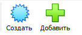
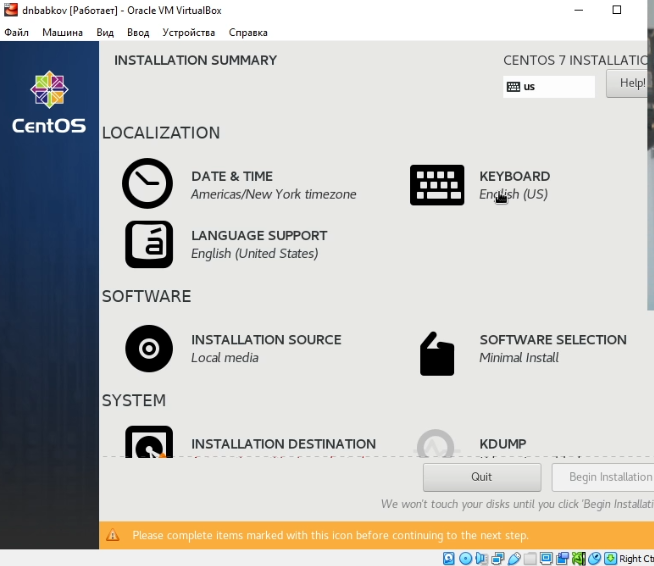
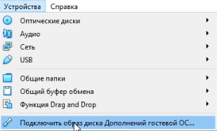
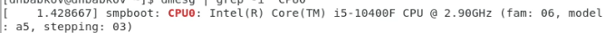
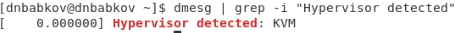

---
## Front matter
title: "Отчёт по лабораторной работе №1"
author: "Бабков Дмитрий Николаевич"

polyglossia-otherlangs:
  name: english
## I18n babel
babel-lang: russian
babel-otherlangs: english
## Fonts
mainfont: PT Serif
romanfont: PT Serif
sansfont: PT Sans
monofont: PT Mono
mainfontoptions: Ligatures=TeX
romanfontoptions: Ligatures=TeX
sansfontoptions: Ligatures=TeX,Scale=MatchLowercase
monofontoptions: Scale=MatchLowercase,Scale=0.9
## Biblatex
biblatex: true
biblio-style: "gost-numeric"
biblatexoptions:
  - parentracker=true
  - backend=biber
  - hyperref=auto
  - language=auto
  - autolang=other*
  - citestyle=gost-numeric
## Pandoc-crossref LaTeX customization
figureTitle: "Рис."
tableTitle: "Таблица"
listingTitle: "Листинг"
lofTitle: "Список иллюстраций"
lotTitle: "Список таблиц"
lolTitle: "Листинги"
## Misc options
indent: true
header-includes:
  - \usepackage{indentfirst}
  - \usepackage{float} # keep figures where there are in the text
  - \floatplacement{figure}{H} # keep figures where there are in the text
---

# Цель работы

Установить операционную систему Linux на виртуальную машину, вспомнить методы работы с git и Markdown

# Задание

Установить операционную систему Linux на виртуальную машину, настроить репозиторий git и написать отчёт в Markdown

# Выполнение лабораторной работы

## Установка и конфигурация операционной системы Linux на виртуальную машину

Первым делом с оффициальных сайтов было скачано приложение VirtualBox и образ диска CentOS 7. Во вкладке ```Файл -> Настройки -> Общее``` я поставил вкладку для машин по умолчанию - D:\VirtualMachines\dnbabkov.

Следующим шагом я создал новую виртуальную машину и указал её имя (Рис. 1, 2):

 (Рис.1)

 (Рис.2)

Далее я настроил параметры виртуальной машины - размер памяти, а также конфигурацию и размер виртуального жёсткого диска (Рис. 3-6):

 (Рис.3)

 (Рис.4)

 (Рис.5)

 (Рис.6)

Далее в настройках виртуальной машины был добавлен новый привод оптических дисков и выбран образ операционной системы (Рис. 7):

 (Рис.7)

После этого я запустил виртуальную машину и приступил к установке и настройке Linux (Рис. 8-11):

 (Рис.8)

 (Рис.9)

 (Рис.10)

 (Рис.11)

Далее я выполнил настройку, выбрал в качестве базового окружения Server with GUI, а в качестве дополнения - Development Tools (Рис. 12):

 (Рис.12)

Также я отключил KDUMP и включил сетевое соединение, изменив имя узла на dnbabkov.localdomain (Рис. 13):

 (Рис.13)

После этого я начал установку, создал пользователя и установил Root пароль (Рис. 14, 15):

 (Рис.14)

 (Рис.15)

После окончания установки я принял пользовательское соглашение и вошёл в профиль пользователя. Там я установил дополнения гостевой ОС (Рис. 16, 17)

 (Рис.16)

 (Рис.17)

После перезапуска виртуальной машины установка и конфигурация были завершены. В качестве дополнительного задания необходимо было проанализировать последовать загрузки системы с помощью команды dmesg и найти версию ядра Linux, частоту процессора, модель процессора, объём доступной памяти и тип обнаруженного гипервизора (Рис. 18-22).

 (Рис.18)

 (Рис.19)

 (Рис.20)

 (Рис.21)

 (Рис.22)

## Конфигурация Git

Первым делом был установлен Git с помощью команды ```sudo yum install git``` (Рис. 23):

 (Рис.23)

После этого был сгенерирован SSH ключ, который был добавлен на github.com (Рис. 24-26):

 (Рис.24)

 (Рис.25)

 (Рис.26)

После этого был создан репозиторий. (Рис. 27):

 (Рис.27)

# Вывод

В ходе выполнения лабораторной работы была настроена виртуальная машина, произведена установка и конфигурация операционной системы, а также настроен git.