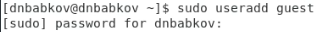
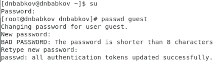

# Лабораторная работа №2
Выполнил: Бабков Дмитрий
№ 1032201726

---

# Цель работы
Получение практических навыков работы в консоли с атрибутами файлов, закрепление теоретических основ дискреционного разграничения доступа в современных системах с открытым кодом на базе ОС Linux.

---

# Создание пользователя

Первым делом в ходе выполнения лабораторной работы был создан новый гостевой профиль и задан его пароль: 

---

---

# Заполнение таблиц

После освоения базовых методов проверки и изменения атрибутов файлов и директорий я приступил к заполнению таблиц.
Для каждого набора атрибутов был проведён ряд исследований, позволивший заполнить таблицы

---

# Таблицы

---

---

# Спасибо за внимание