---
## Front matter
title: "Отчёт по лабораторной работе №2"
author: "Бабков Дмитрий Николаевич"

polyglossia-otherlangs:
  name: english
## I18n babel
babel-lang: russian
babel-otherlangs: english
## Fonts
mainfont: PT Serif
romanfont: PT Serif
sansfont: PT Sans
monofont: PT Mono
mainfontoptions: Ligatures=TeX
romanfontoptions: Ligatures=TeX
sansfontoptions: Ligatures=TeX,Scale=MatchLowercase
monofontoptions: Scale=MatchLowercase,Scale=0.9
## Biblatex
biblatex: true
biblio-style: "gost-numeric"
biblatexoptions:
  - parentracker=true
  - backend=biber
  - hyperref=auto
  - language=auto
  - autolang=other*
  - citestyle=gost-numeric
## Pandoc-crossref LaTeX customization
figureTitle: "Рис."
tableTitle: "Таблица"
listingTitle: "Листинг"
lofTitle: "Список иллюстраций"
lotTitle: "Список таблиц"
lolTitle: "Листинги"
## Misc options
indent: true
header-includes:
  - \usepackage{indentfirst}
  - \usepackage{float} # keep figures where there are in the text
  - \floatplacement{figure}{H} # keep figures where there are in the text
---

# Цель работы

Получение практических навыков работы в консоли с атрибутами файлов, закрепление теоретических основ дискреционного разграничения доступа в современных системах с открытым кодом на базе ОС Linux.

# Задание

Выполнить ряд команд для исследования прав доступа на файлы, а также заполнить две таблицы

# Выполнение лабораторной работы

1. В установленной при выполнении предыдущей лабораторной работы операционной системе была создана учётная запись guest с помощью команды ```sudo useradd guest``` (Рис. 1)

    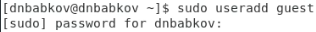

2. Далее я использовал команду ```su```, чтобы получить root-права и командой ```passwd guest``` задал пароль для гостевого пользователя (Рис. 2)

    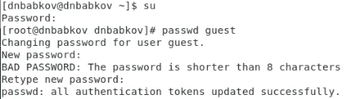

3. Далее я вошёл в гостевую учётную запись (Рис. 3)

    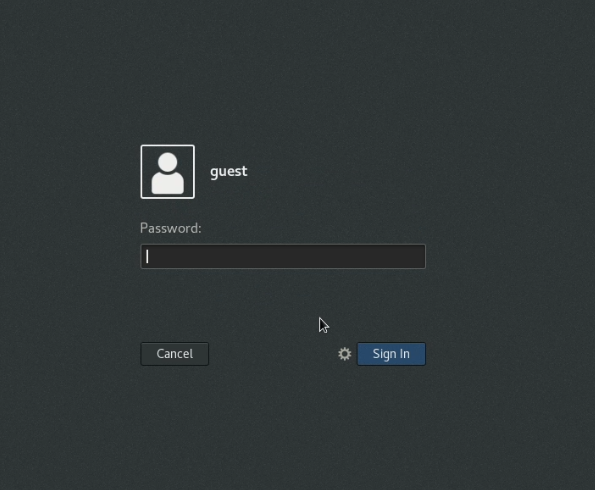

4. После этого с помощью команды ```pwd``` проверил, в какой директории нахожусь (Рис. 4)
    
    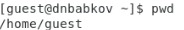

    Директория является домашней

5. С помощью команды ```whoami``` уточнил имя пользователя (Рис. 5)

    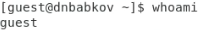

6. Далее я использовал команды ```id``` и ```groups``` и сравнил их вывод: вывод команды ```groups``` соответствует пункту groups в выводе команды ```id```. Также запомнил значения uid и gid (Рис. 6)

    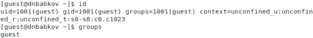

7. После этого командами ```cat /etc/passwd | grep guest``` и ```cat /etc/passwd | grep dnbabkov``` просмотрел файл ```/etc/passwd```, выводя информацию о гостевом и пользовательском профилях (Рис. 7)

    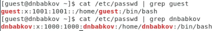

8. Командой ```ls -l /home/``` определил существующие в системе директории, а также увидел, какие права на них установлены (Рис. 8)

    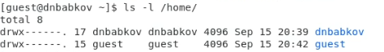

9. Командой ```lsattr /home``` попытался увидеть расширенные атрибуты, установленные на поддиректории, находящиеся в директории ```/home```. Мне удалось увидеть расширенные атрибуты директории ```/home/guest```, но не удалось увидеть атрибуты других пользователей (Рис. 9)
    
    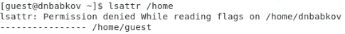

10. Далее я создал поддиректорию dir1 и проверил её права доступа (Рис. 10)

    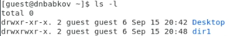

11. Далее командой ```chmod 000 dir1``` я снял с директории все атрибуты и проверил выполнение (Рис. 11)

    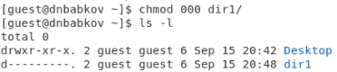

12. Далее командой ```echo "test" > /home/guest/dir1/file1``` я попытался создать файл file1 в директории dir1, но не смог этого сделать по причине того, что я не имею прав на взаимодействие с этой директорией (Рис. 12)

    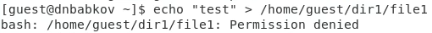

13. Далее я заполнил таблицы «Установленные права и разрешённые действия» и «Минимальные права для совершения операций», проверяя каждый из пунктов таблицы опытным путём (Рис. 13, 14)

     («Установленные права и разрешённые действия»)

     («Минимальные права для совершения операций»)

# Вывод

В ходе выполнения лабораторной работы были получены навыки изменения настроек доступа для файлов в ОС Linux