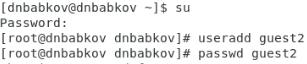
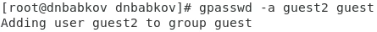

# Лабораторная работа №2
Выполнил: Бабков Дмитрий
№ 1032201726

---

# Цель работы
Получение практических навыков работы в консоли с атрибутами файлов для групп пользователей, закрепление теоретических основ дискреционного разграничения доступа в современных системах с открытым кодом на базе ОС Linux.

---

# Создание второго гостевого профиля

Первым делом в ходе выполнения лабораторной работы был создан новый гостевой профиль guest2 и задан его пароль: 

---

# Добавление в группу

Далее пользователь guest2 был добавлен и зарегистрирован в группе guest:

---

# Заполнение таблиц

Далее, изменяя атрибуты директорий и файлов от лица пользователя guest и проверяя от лица пользователя guest2, проверил доступные действия в соответствии с установленными разрешениями и заполнил таблицыы

---

# Таблицы

---

---

# Спасибо за внимание