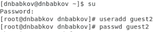
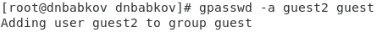
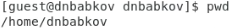
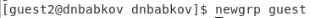

---
## Front matter
title: "Отчёт по лабораторной работе №3"
author: "Бабков Дмитрий Николаевич"

polyglossia-otherlangs:
  name: english
## I18n babel
babel-lang: russian
babel-otherlangs: english
## Fonts
mainfont: PT Serif
romanfont: PT Serif
sansfont: PT Sans
monofont: PT Mono
mainfontoptions: Ligatures=TeX
romanfontoptions: Ligatures=TeX
sansfontoptions: Ligatures=TeX,Scale=MatchLowercase
monofontoptions: Scale=MatchLowercase,Scale=0.9
## Biblatex
biblatex: true
biblio-style: "gost-numeric"
biblatexoptions:
  - parentracker=true
  - backend=biber
  - hyperref=auto
  - language=auto
  - autolang=other*
  - citestyle=gost-numeric
## Pandoc-crossref LaTeX customization
figureTitle: "Рис."
tableTitle: "Таблица"
listingTitle: "Листинг"
lofTitle: "Список иллюстраций"
lotTitle: "Список таблиц"
lolTitle: "Листинги"
## Misc options
indent: true
header-includes:
  - \usepackage{indentfirst}
  - \usepackage{float} # keep figures where there are in the text
  - \floatplacement{figure}{H} # keep figures where there are in the text
---

# Цель работы

Получение практических навыков работы в консоли с атрибутами файлов для групп пользователей, закрепление теоретических основ дискреционного разграничения доступа в современных системах с открытым кодом на базе ОС Linux.

# Задание

Выполнить ряд команд для исследования прав доступа на файлы, а также заполнить две таблицы

# Выполнение лабораторной работы

1. В дополнение к созданной в предыдущей лабораторной работе учётной записи guest была создана вторая учётная запись guest2 и задан для неё пароль (Рис. 1)

    

2. Далее пользователь guest2 был добавлен в группу guest (Рис. 2):

    

3. Следующим шагом я вошёл в двух разных терминалах в учётные записи guest и guest2 (Рис. 3, 4)

    

    

4. Для обоих пользователей командой ```pwd``` определил, в какой директории нахожусь (Рис. 5, 6)

    

    

5. Командами ```whoami``` и ```id``` уточнил имена пользователей, а также то, в какие группы они входят (Рис. 7 - 10)

    

    

    

    

    Можно увидеть, что второй пользователь входит в группы guest2 и guest.

    Далее командами ```group guest``` и ```group guest2``` вновь определил, в какие группы входят эти пользователи и сравнил выведенную информацию с выводом команд ```id -Gn``` и ```id -G``` для обоих пользователей (Рис. 11, 12)

    

    

    Вывод команды ```id -Gn``` практически идентичен выводу команды groups \*имя_соответствующего_пользователя\*

6. Командой ```cat /etc/group``` просмотрел соответсвтующий файл, в котором увидел, какие пользователи в каких группах находятся (Рис. 13)

    

7. Командой ```newgrp guest``` от имени пользователя guest2 зарегистрировался в группе guest (Рис. 14).

    
   
8. Далее от имени пользователя guest изменил права директории /home/guest командой ```chmod g+rwx /home/guest```, разрешив пользователям группы все действия (Рис. 15)

    

9.  От имени пользователя guest снял с директории /home/guest/dir1
все атрибуты командой ```chmod 000 dirl``` и проверил правильность снятия атрибутов (Рис. 16)

    

10. Далее, меняя от имени пользователя guest атрибуты директории dir1 и файла file1 и проверяя доступные действия от имени пользователя guest2, заполнил таблицы 3.1 и 3.2 (Рис. 17, 18)

     («Установленные права и разрешённые действия»)

     («Минимальные права для совершения операций»)

# Вывод

В ходе выполнения лабораторной работы были получены навыки изменения настроек доступа для файлов в ОС Linux, а также приобретены теоретические знания о настройках атрибутов для групп