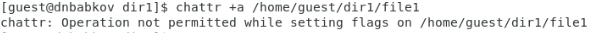
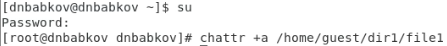
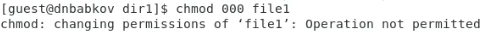
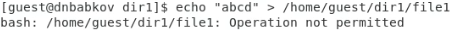
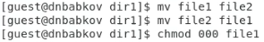

# Лабораторная работа №4
Выполнил: Бабков Дмитрий
№ 1032201726

---

# Цель работы

Получение практических навыков работы в консоли с расширенными
атрибутами файлов.

---

# Изменение расширенных атрибутов файла

Расширенные атрибуты могут изменяться администратором или суперпользователем

---

# Эффект атрибута a

Многие команды (например echo, chmod и mv) невозможно выполнить:

---

# Эффект атрибута i

Атрибут i имеет эффект схожий с атрибутом a, но также запрещает проводить  некоторые операции суперпользователю

---

# Спасибо за внимание
