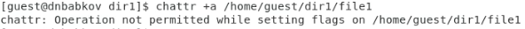
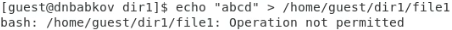
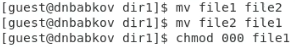
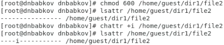

---
## Front matter
title: "Отчёт по лабораторной работе №4"
author: "Бабков Дмитрий Николаевич"

polyglossia-otherlangs:
  name: english
## I18n babel
babel-lang: russian
babel-otherlangs: english
## Fonts
mainfont: PT Serif
romanfont: PT Serif
sansfont: PT Sans
monofont: PT Mono
mainfontoptions: Ligatures=TeX
romanfontoptions: Ligatures=TeX
sansfontoptions: Ligatures=TeX,Scale=MatchLowercase
monofontoptions: Scale=MatchLowercase,Scale=0.9
## Biblatex
biblatex: true
biblio-style: "gost-numeric"
biblatexoptions:
  - parentracker=true
  - backend=biber
  - hyperref=auto
  - language=auto
  - autolang=other*
  - citestyle=gost-numeric
## Pandoc-crossref LaTeX customization
figureTitle: "Рис."
tableTitle: "Таблица"
listingTitle: "Листинг"
lofTitle: "Список иллюстраций"
lotTitle: "Список таблиц"
lolTitle: "Листинги"
## Misc options
indent: true
header-includes:
  - \usepackage{indentfirst}
  - \usepackage{float} # keep figures where there are in the text
  - \floatplacement{figure}{H} # keep figures where there are in the text
---

# Цель работы

Получение практических навыков работы в консоли с расширенными
атрибутами файлов.

# Задание

Выполнить ряд операций с расширенными атрибутами файлов

# Выполнение лабораторной работы

Первым делом от имени пользователя guest я определил расширенные атрибуты файла ```/home/guest/dir1/file1``` командой ```lsattr /home/guest/dir1/file1``` и командой ```chmod 600 file1``` установил права, разрешающие чтение и запись для владельца файла. (Рис. 1, 2)


После этого попробовал установить на этот файл расширенный атрибут a от имени пользователя guest командой ```chattr +a /home/guest/dir1/file1```, но получил сообщение о том, что данное действие запрещено (Рис. 3)



Далее я открыл новый терминал, в котором повысил права пользователя командой su и установил расширенный атрибут а и проверил установку от имени пользователя guest (Рис. 4, 5)


Командой ```echo "test" >> /home/guest/dir1/file1``` дозаписал в файл file1 слово test и проверил выполнение командой ```cat /home/guest/dir1/file1``` (Рис. 6)


После этого я попытался командой ```echo "abcd" > /home/guest/dir1/file1``` изменить информацию в файле file1, а также переименовать файл, но получил отказ (Рис. 7, 8)




Далее командой ```chmod 000 file1``` я попробовал изменить права на файл, на что тоже получил отказ (Рис. 9)


Сняв расширенный атрибут а командой ```chattr -a /home/guest/dir1/file1``` от имени суперпользователя, я повторил действия, выполнение которых было запрещено (Рис. 10, 11)




В результате я смог произвести все ранее запрещённые операции.

Далее я создал второй файл - file2, на который установил расширенный атрибут i и повторил шаги, указанные выше (Рис. 12-17)





Все операции, которые были запрещены с атрибутом а также запрещены при добавлении атрибута i. При этом суперпользователь также не имеет права изменять файл с атрибутом i

# Вывод

В результате выполнения работы я повысил свои навыки использования интерфейса командой строки (CLI), познакомился на примерах с тем, как используются основные и расширенные атрибуты при разграничении доступа. Имел возможность связать теорию дискреционного разделения доступа (дискреционная политика безопасности) с её реализацией на практике в ОС Linux. Составил наглядные таблицы, поясняющие какие операции возможны при тех или иных установленных правах. Опробовал действие на практике расширенных атрибутов «а» и «i».