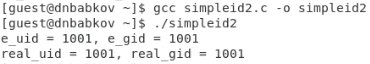
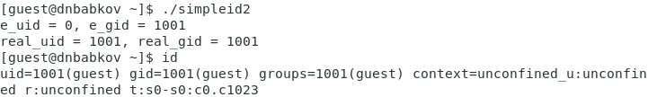

# Лабораторная работа №5
Выполнил: Бабков Дмитрий
№ 1032201726

---

# Компилирование программ на C

Компилирование програм на C выполняется с помощью gcc:

---

# SetUID и SetGID

Программы с установленными SetUID/SetGID-битами выполняются с использованием UID/GID пользователя/группы

---

# Sticky-бит

Sticky-бит, установленный на директорию, запрещает удаление файлов, владельцем которых пользователь не является

---

# Спасибо за внимание