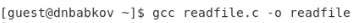
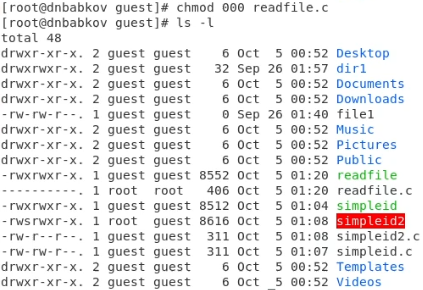
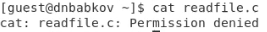

---
## Front matter
title: "Отчёт по лабораторной работе №5"
author: "Бабков Дмитрий Николаевич"

polyglossia-otherlangs:
  name: english
## I18n babel
babel-lang: russian
babel-otherlangs: english
## Fonts
mainfont: PT Serif
romanfont: PT Serif
sansfont: PT Sans
monofont: PT Mono
mainfontoptions: Ligatures=TeX
romanfontoptions: Ligatures=TeX
sansfontoptions: Ligatures=TeX,Scale=MatchLowercase
monofontoptions: Scale=MatchLowercase,Scale=0.9
## Biblatex
biblatex: true
biblio-style: "gost-numeric"
biblatexoptions:
  - parentracker=true
  - backend=biber
  - hyperref=auto
  - language=auto
  - autolang=other*
  - citestyle=gost-numeric
## Pandoc-crossref LaTeX customization
figureTitle: "Рис."
tableTitle: "Таблица"
listingTitle: "Листинг"
lofTitle: "Список иллюстраций"
lotTitle: "Список таблиц"
lolTitle: "Листинги"
## Misc options
indent: true
header-includes:
  - \usepackage{indentfirst}
  - \usepackage{float} # keep figures where there are in the text
  - \floatplacement{figure}{H} # keep figures where there are in the text
---

# Цель работы

Изучение механизмов изменения идентификаторов, применения SetUID- и Sticky-битов. Получение практических навыков работы в консоли с дополнительными атрибутами. Рассмотрение работы механизма смены идентификатора процессов пользователей, а также влияние бита Sticky на запись и удаление файлов.

# Выполнение лабораторной работы

Первым делом командой ```setenforce 0``` была отключена система SELinux и командой ```getenforce``` была проверена корректность выполнения (Рис. 1)


После входа в систему от имени гостевого пользователя была создана программа simpleid (Рис. 2, 3)


Программа была скомпилирована и запущена. После этого было произведено сравнение вывода программы и вывода команды id (Рис. 4):


Далее программа была усложнена и сохранена в файл ```simpleid2``` (Рис. 5)


После этого команда была скомпилирована и запущена (Рис. 6)


От имени суперпользователя была произведена смена пользователя и атрибутов файла ```simpleid2```, после чего вновь было запущено выполнение программы и выполнена команда id (Рис. 7, 8, 9):


UID отличается по той причине, что у файла другой владелец

Следующем шагом была создана и откомпилированна программа readfile (Рис. 10, 11)




Далее были изменены владелец и атрибуты файла ```readfile.c``` (Рис. 12, 13)




Была произведена проверка возможности пользователя guest прочитать файл ```readfile.c``` (Рис. 14)



Далее с помощью программы были прочитаны файлы readfile.c и /etc/shadow (Рис. 15, 16)


Файлы были успешно прочитаны.

Далее командой ```ls -l / | grep tmp``` было проверено, установлен ли Sticky бит на директории tmp (Рис. 17)


От имени пользователя был создан файл file01, и добавлены всем пользователям права на чтение и запись в этот файл (Рис. 18)


От имени другого пользователя был прочитан, записан и перезаписан файл file01, а также была произведена неудачная попытка удалить файл (Рис. 19)


Далее от имени суперпользователя с директории tmp был снят атрибут t (Рис. 20):


Были повторно произведены описанные выше шаги. В этот раз удаление файла было разрешено (Рис. 21)


В конце атрибут t был возвращён директории tmp (Рис. 22):


# Вывод

В ходе выполнения лабораторной работы было приобретено понимание принципов работы Sticky- и SetUID-битов