---
## Front matter
title: "Отчёт по лабораторной работе №5"
author: "Бабков Дмитрий Николаевич"

polyglossia-otherlangs:
  name: english
## I18n babel
babel-lang: russian
babel-otherlangs: english
## Fonts
mainfont: PT Serif
romanfont: PT Serif
sansfont: PT Sans
monofont: PT Mono
mainfontoptions: Ligatures=TeX
romanfontoptions: Ligatures=TeX
sansfontoptions: Ligatures=TeX,Scale=MatchLowercase
monofontoptions: Scale=MatchLowercase,Scale=0.9
## Biblatex
biblatex: true
biblio-style: "gost-numeric"
biblatexoptions:
  - parentracker=true
  - backend=biber
  - hyperref=auto
  - language=auto
  - autolang=other*
  - citestyle=gost-numeric
## Pandoc-crossref LaTeX customization
figureTitle: "Рис."
tableTitle: "Таблица"
listingTitle: "Листинг"
lofTitle: "Список иллюстраций"
lotTitle: "Список таблиц"
lolTitle: "Листинги"
## Misc options
indent: true
header-includes:
  - \usepackage{indentfirst}
  - \usepackage{float} # keep figures where there are in the text
  - \floatplacement{figure}{H} # keep figures where there are in the text
---

# Цель работы

Развить навыки администрирования ОС Linux. Получить первое практическое знакомство с технологией SELinux. Проверить работу SELinx на практике совместно с веб-сервером Apache.

# Выполнение лабораторной работы

Первым делом был осуществлён вход в систему и проверены режим и политика SELinux (Рис. 1)

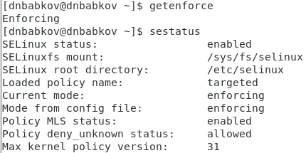

С помощью команды `service httpd status` была проверена работа веб-сервера. С помощью команды `service httpd start` веб-сервер был запущен (Рис. 2, 3)

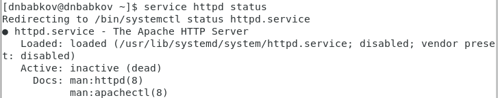
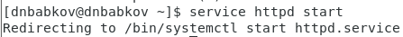

Командой `ps auxZ | grep httpd` веб-сервер был найден в списке процессов, а также был определён его контекст безопасности (unconfined_t) (Рис. 4)

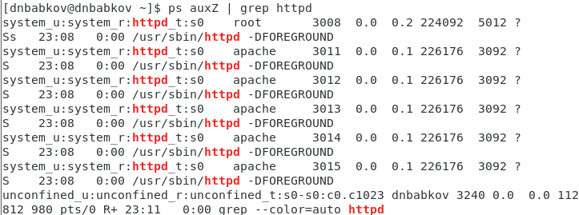

Командой sestatus -b | grep httpd было просмотрено текущее состояние переключателей SELinux для Apache (Рис. 5)

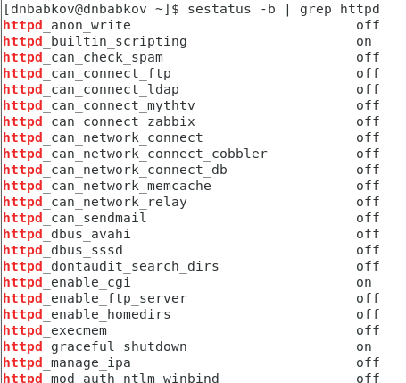

Большая часть из них имеет статус `off`

Командой `ls -lZ /var/www` был определён тип файлов и поддиректорий в директории `www` (Рис. 6)

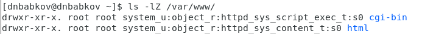

В директории находятся две поддиректории типа object_r

В поддиректории /var/www/html файлы отсутствуют, а создание файлов разрешено только root пользователю

От имени суперпользователя был создан файл test.html. Содержимое файла:

\<html> \
\<body>test\</body> \
\</html>

Далее к файлу было произведено обращение через веб-сервер (Рис. 7)

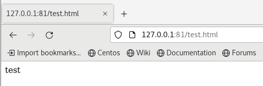

Следующим шагом контекст файла был изменён на `samba_share_t` (Рис. 8)

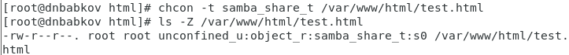

При попытке получить доступ к файлу через веб-сервер была получена ошибка (Рис. 9)

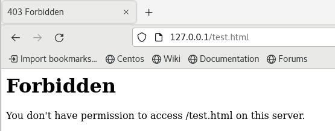

Файл не был отображён, потому что параметры безопасности SELinux не позволяют веб-серверу открывать файлы, не являющиеся `httpd_sys_content_t`

Далее были просмотрены log-файлы веб-сервера Apache (Рис. 10)

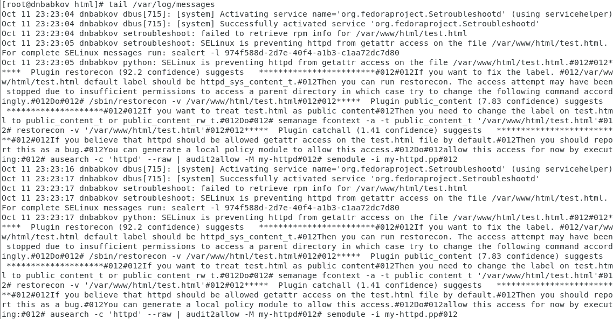

Далее в файле `/etc/httpd/httpd.conf` была найдена строчка Listen 80, и заменена на Listen 81

После перезапуска веб-сервера сбоя не произошло, потому что порт 81 тоже является частью политики Apache (Рис. 11)

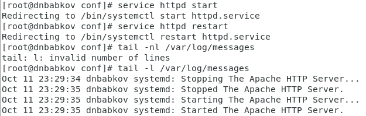

Далее была произведена попытка добавить порт 81, которая не удалась по причине того, что порт уже существует (Рис. 12)

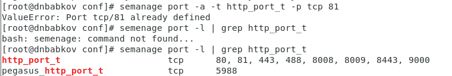

Если бы порта не было, то попытка перезапуска веб-сервера провалилась бы по причине того, что он не смог бы осуществить подключение. При добавлении порта подключение вновь стало бы возможно.

Следующим шагом файлу test.html был возвращен изначальный контекст, и произведено открытие файла в браузере (Рис. 13)

Конфигурационный файл Apache был возвращён в изначальное состояние. Была произведена попытка удалить порт 81 (Рис. 14)

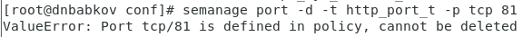

Последним шагом было удаление файла test.html