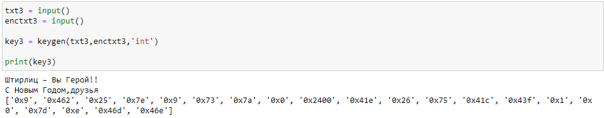
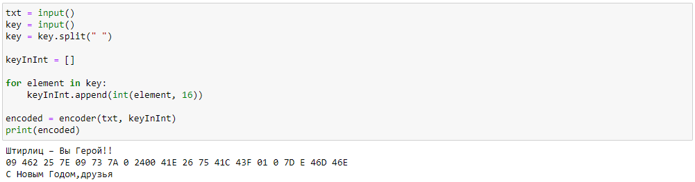
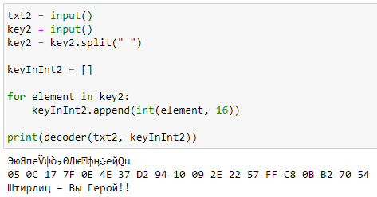

---
## Front matter
title: "Отчёт по лабораторной работе №7"
author: "Бабков Дмитрий Николаевич"

polyglossia-otherlangs:
  name: english
## I18n babel
babel-lang: russian
babel-otherlangs: english
## Fonts
mainfont: PT Serif
romanfont: PT Serif
sansfont: PT Sans
monofont: PT Mono
mainfontoptions: Ligatures=TeX
romanfontoptions: Ligatures=TeX
sansfontoptions: Ligatures=TeX,Scale=MatchLowercase
monofontoptions: Scale=MatchLowercase,Scale=0.9
## Biblatex
biblatex: true
biblio-style: "gost-numeric"
biblatexoptions:
  - parentracker=true
  - backend=biber
  - hyperref=auto
  - language=auto
  - autolang=other*
  - citestyle=gost-numeric
## Pandoc-crossref LaTeX customization
figureTitle: "Рис."
tableTitle: "Таблица"
listingTitle: "Листинг"
lofTitle: "Список иллюстраций"
lotTitle: "Список таблиц"
lolTitle: "Листинги"
## Misc options
indent: true
header-includes:
  - \usepackage{indentfirst}
  - \usepackage{float} # keep figures where there are in the text
  - \floatplacement{figure}{H} # keep figures where there are in the text
---

# Цель работы

Освоить на практике применение режима однократного гаммирования

# Выполнение лабораторной работы

В ходе выполнения лабораторной работы была написана программа, которая может создавать зашифрованный текст, получая на вход исходный текст и ключ шифрования, расшифровывать текст с помощью зашифрованного текста и ключа, а также получать ключ, чтобы превратить заданный зашифрованный текст в расшифрованный текст.

Код программы:

```
def encoder(text, key):
    
    encodedText = ''
    
    if (len(text) == len(key)):

        if(type(key[0]) is int):
            for i in range(len(text)):
                encodedText += chr(ord(text[i]) ^ key[i])
        else:
            for i in range(len(text)):
                encodedText += chr(ord(text[i]) ^ ord(key[i]))
            
        return encodedText

    else:
        return

def decoder(encodedText, key):
    
    decodedText = ''
    
    if (len(encodedText) == len(key)):
        
        if(type(key[0]) is int):
            
            for i in range(len(encodedText)):
                
                decodedText += chr(ord(encodedText[i]) ^ key[i])
                
        elif(type(encodedText[0]) is int):
            
            for i in range(len(encodedText)):
                
                decodedText += chr(encodedText[i] ^ ord(key[i]))
                
        elif((type(encodedText[0]) is int) & (type(key[0]) is int)):
            
            for i in range(len(encodedText)):
                
                decodedText += chr(encodedText[i] ^ key[i])
                
        else:
            
            for i in range(len(encodedText)):
                
                decodedText += chr(ord(encodedText[i]) ^ ord(key[i]))
                
        return decodedText
    
    else:
        
        return

def keygen(text, encodedText, astype):
    
    if(astype == 'int'):
        
        key = []
        
    else:
        
        key = ''
    
    if(len(text) == len(encodedText)):
        
        if (astype == 'int'):
            
            for i in range(len(encodedText)):
            
                key.append(hex(ord(text[i]) ^ ord(encodedText[i])))
                
        else:            
        
            for i in range(len(encodedText)):

                key += chr(ord(text[i]) ^ ord(encodedText[i]))
    
        return key
    
    else:

        return

txt = input()
key = input()
key = key.split(" ")

keyInInt = []

for element in key:
    keyInInt.append(int(element, 16))

encoded = encoder(txt, keyInInt)
print(encoded)

txt2 = input()
key2 = input()
key2 = key.split(" ")

keyInInt2 = []

for element in key2:
    keyInInt2.append(int(element, 16))
    
print(decoder(txt2, keyInInt2))

txt3 = input()
enctxt3 = input()

key3 = keygen(txt,enctxt,'int')

print(key3)
```

Результат выполнения команд (Рис. 1 - 3):

Генерация ключа:



Получение закодированного сообщения из открытого:



Декодирование текста по ключу:

